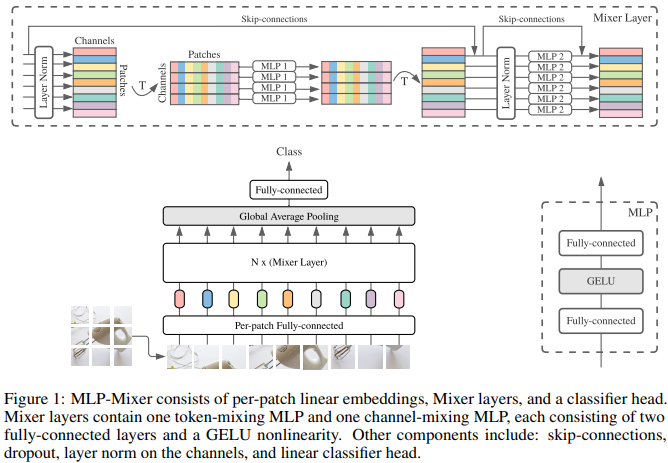

</img>

## MLP Mixer - Pytorch

An <a href="https://arxiv.org/abs/2105.01601">All-MLP solution</a> for Vision, from Google AI, in Pytorch.

No convolutions nor attention needed!

<a href="https://youtu.be/7K4Z8RqjWIk">Yannic Kilcher video</a>

## Install

```bash
$ pip install mlp-mixer-pytorch
```

## Usage

```python
import torch
from mlp_mixer_pytorch import MLPMixer

model = MLPMixer(
    image_size = 256,
    channels = 3,
    patch_size = 16,
    dim = 512,
    depth = 12,
    num_classes = 1000
)

img = torch.randn(1, 3, 256, 256)
pred = model(img) # (1, 1000)
```

Rectangular image

```python
import torch
from mlp_mixer_pytorch import MLPMixer

model = MLPMixer(
    image_size = (256, 128),
    channels = 3,
    patch_size = 16,
    dim = 512,
    depth = 12,
    num_classes = 1000
)

img = torch.randn(1, 3, 256, 128)
pred = model(img) # (1, 1000)
```

Video

```python
import torch
from mlp_mixer_pytorch import MLPMixer3D

model = MLPMixer3D(
    image_size = (256, 128),
    time_size = 4,
    time_patch_size = 2,
    channels = 3,
    patch_size = 16,
    dim = 512,
    depth = 12,
    num_classes = 1000
)

video = torch.randn(1, 3, 4, 256, 128)
pred = model(video) # (1, 1000)
```

## Citations

```bibtex
@misc{tolstikhin2021mlpmixer,
    title   = {MLP-Mixer: An all-MLP Architecture for Vision},
    author  = {Ilya Tolstikhin and Neil Houlsby and Alexander Kolesnikov and Lucas Beyer and Xiaohua Zhai and Thomas Unterthiner and Jessica Yung and Daniel Keysers and Jakob Uszkoreit and Mario Lucic and Alexey Dosovitskiy},
    year    = {2021},
    eprint  = {2105.01601},
    archivePrefix = {arXiv},
    primaryClass = {cs.CV}
}
```

```bibtex
@misc{hou2021vision,
    title   = {Vision Permutator: A Permutable MLP-Like Architecture for Visual Recognition},
    author  = {Qibin Hou and Zihang Jiang and Li Yuan and Ming-Ming Cheng and Shuicheng Yan and Jiashi Feng},
    year    = {2021},
    eprint  = {2106.12368},
    archivePrefix = {arXiv},
    primaryClass = {cs.CV}
}
```
